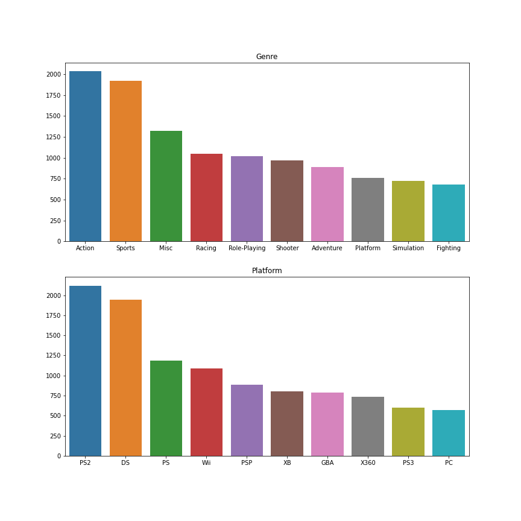
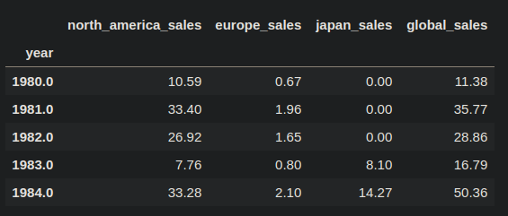
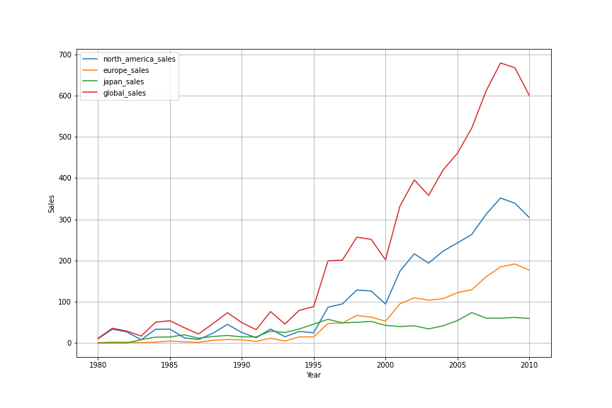

# Compulsory Assignment 1 - Pandas and visualizations
## DAT200 - Spring 2021  
---

### Part I:  
## Loading and exploring the dataset

__1. Load the dataset named `videogames.csv` from the `assets` folder and store it in a dataframe called `raw_df`__


__2. Print the first `five` rows of the dataframe__


__3. How many unique values exist in each of the columns `genre` and `publisher`?__


__4. Identify missing (NaN) values in the dataset__


__5. Create a copy of `raw_df` named `df`. Remove any rows containing NaN values in the new dataframe. What is the shape of `df` before and after removing the NaN values?__


__6. Which `platform`, `genre` and `publisher` is the most popular (by number of instances) of all time? Print the name and count of each__

Hint: The output should look something like this:
```python
Column: [col], Most popular: [name], Count: [count]
Column: [col], Most popular: [name], Count: [count]
Column: [col], Most popular: [name], Count: [count]
```


__7. What is the most popular game for each region? E.g. North America, Europe and Japan and globally__


__8. Create a new dataframe called `df_pokemon` containing all games with "pokemon" in the `name`__

Hint: Make sure your filtering is NOT case-sensitive

a. What is the most-sold (globally) Pokemon game of all time?

b. How many Pokemon-games are in the dataset?


---

### Part II: 
## Visualizing the dataset


__9. Create plot with 2 vertical axes and one horizontal axes. The plot should display a barchart containing the `count` of the `10 most frequent` genres and platforms, each in its own subplot. The bars should be sorted in descending order.__

Hint: It is recommended to use the `Barplot` function built into Seaborn for barcharts.

The output should look something like this:



PS: Disregard the color scheme of the example image.


__10. Group sales in `df` for the four different regions _by year_ into a new dataframe; `yearly_sales`__

Hint: Sales should be aggregated by the `sum` of all sales within the year.

The first five rows of the new dataframe should look like this:





__11. Create a correlation matrix (based on the aggregated sales data) and plot it as a `heatmap` using Seaborn. What does the plot tell you about correlation between sales in the given regions?__


__12. Create a lineplot showing sales per year for all four regions over the entire period__

The end result should look something like this:


